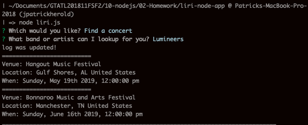
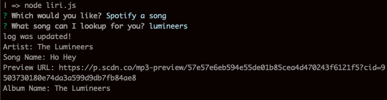
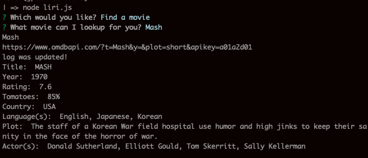
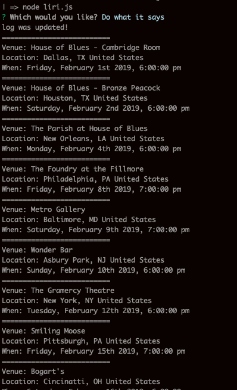

# liri-node-app
LIRI is like iPhone's SIRI. However, while SIRI is a Speech Interpretation and Recognition Interface, LIRI is a _Language_ Interpretation and Recognition Interface. LIRI will be a command line node app that takes in parameters and gives you back data.

## require("inquirer")
Uses looping inquirer prompt to collect relevant user data based on user entries.

## require("axios");
Uses axios to get results from the following API:
..* - node-spotify-api
..* - rest.bandsintown.com
..* - omdbapi.com

## require('./key' && dotenv)
Maintains secret keys in seperate file not included in git repo.

## require('moment');
Light date formatting

## require('fs');
Write log file. Read comman files.

===========================================================================

## Screen Shots:

### Find a concert:

### Look up a song:

### Look up a movie:

### Execute the command in a file:

